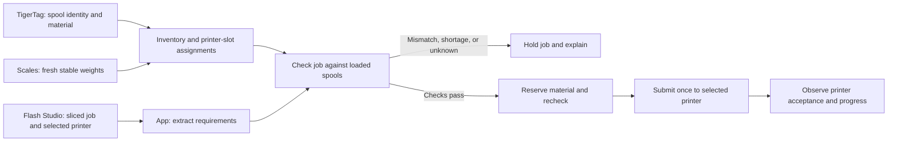

# Filament-aware print workflow

Status: live monitoring, reminders, and initial Flash Studio G-code metadata inspection are implemented. Scale ingestion, RFID association, inventory validation, and print forwarding are not implemented yet.

## Confirmed requirements

- Keep Flashforge cloud enabled.
- Monitor AD5M, Adventurer 5M Pro, Creator 5, and Creator 5 Pro.
- Use SUNLU S4 and S2 dryers with an independent scale under every spool.
- Use TigerTag NFC/RFID to identify filament spools.
- Prepare jobs in Flash Studio and let the user select the destination printer.
- Check the required materials, colors, and quantities before forwarding a job.
- Track printing hours and calendar intervals for maintenance reminders.

The current dashboard monitors all four printers while cloud is enabled and supports independent maintenance tasks per printer. Live cloud status now works on all four models using the signed-in Flash Studio session and direct MQTT subscriptions. No printer settings have been changed and no print jobs have been submitted by the app.

## Intended workflow

Start with an exported, sliced Flash Studio file imported into the app. A direct Flash Studio “send to app” target is a separate integration to verify, not an assumed existing feature. An STL or unsliced 3MF cannot supply reliable per-filament requirements; the app is not intended to be another slicer.

## Spools, scales, and assignments

Give each physical spool a stable inventory ID. Preserve its tag UID(s), material, manufacturer/product identity, color, empty-spool weight, and any adapter weight. Twin TigerTag tags must resolve to the same spool. Record identity changes when a reusable tag is moved to a new spool.

Each dryer position gets its own stable slot and scale ID. Separately map the dryer position to the printer's actual filament input/tool. A spool sitting in a dryer does not establish which printer it feeds. In particular, assigning a tagged spool in this app must not be presented as native Flashforge RFID detection.

For every measurement, retain gross mass, tare, net filament mass, timestamp, stability, calibration identity, and uncertainty. Missing tare or a disconnected scale means unknown quantity, not zero grams. Reading a stored quantity from a tag is not a fresh scale reading.

Proposed available quantity for validation:

`available grams = measured net filament − other job reservations − measurement allowance`

The allowance and a job's consumption reserve must be visible and configurable after hardware testing. Do not advertise an exact weight. Accuracy depends on calibration, empty-spool tare, mechanical isolation, heat, spool contact, and filament pulling force. Test readings with the dryer cold, hot, and feeding before choosing a claimed tolerance. A single scale under an entire dryer would not identify individual spool weights; this design uses one per spool as requested.

## Job checks

Extract requirements from the original sliced file for the selected plate: printer profile, nozzle/tool configuration, material type/profile, color or product identity, and estimated grams for every used filament. Confirm the metadata against a real Flash Studio export before implementing a parser. Unsupported or incomplete metadata should produce “Cannot verify,” never a pass.

Match every requirement to a loaded spool and printer input. Prefer exact product/color identification when available. A matching display color or generic “PLA” label alone does not establish the same formulation or finish; a substitution should require an explicit user choice.

Use the slicer's total extrusion estimate, including support, purge, and prime-tower consumption when included. Determine whether those quantities are already part of the exported totals to avoid adding them twice. Add an explicit reserve for consumption uncertainty.

Hold the job when a material/color is wrong, quantity is insufficient, readings are stale or unstable, tare is unknown, a spool assignment is missing, or the selected printer is incompatible/unavailable. Show the reason per filament and the required-versus-available grams.

Reserve quantities for queued jobs so multiple jobs cannot spend the same filament. Revalidate fresh weight, spool assignment, and printer readiness immediately before submission. Distinguish upload, accepted job, and observed printing. An ambiguous timeout must not cause an automatic duplicate print; reconcile printer state first. The queue does not establish that the physical build plate is clear.

After printing, reconcile stable measured quantities with the reservation; do not subtract estimated usage again from a scale reading that already reflects consumed filament. Spool swaps or changed assignments invalidate an earlier check.

## Delivery stages

1. Prototype and calibrate one continuously weighed spool position in a dryer; validate hot/cold and feeding behavior.
2. Read its TigerTag, associate the spool with a dryer position and printer input, and display fresh weight with measurement quality.
3. Parse a representative Flash Studio sliced export and produce a reviewable material/color/quantity report. Initially validate only; do not submit jobs.
4. Add reservations and test submission to one selected printer while preserving cloud connectivity. Verify actual printer acceptance.
5. Expand to every spool position and printer once their individual connection paths are verified. Connect job/filament history to maintenance reporting.

## Dependencies and unresolved points

- Scale hardware and installed calibration results are not yet available. TigerScale V3 is a reference platform, not a proven drop-in multi-spool dryer retrofit.
- A Flash Studio 1.7.17 Creator 5 G-code export has now been inspected. Material, color, per-channel gram estimates, printer/nozzle profile, layers, and time are available. The first browser inspector supports that header format and flags conflicting estimates. Its summary reports 63.32 g versus 61.27 g in the filament records; purge accounting and the reason for the discrepancy remain unverified. Additional exports are needed before claiming broad format support; sliced 3MF is not implemented.
- Direct job submission from Flash Studio to this app has not been verified.
- Cloud-compatible upload/start has not been verified on any of the four printers. Read-only TCP status on the Adventurers does not prove upload/start compatibility.
- C5/C5P still reject local HTTP status with LAN mode off and expose no legacy TCP status service. Live cloud monitoring is now verified; cloud-compatible job upload/start remains a separate unimplemented dependency.

## Reference projects

[TigerScale V3](https://github.com/TigerTag-Project/Tiger-Scale-V3) provides an ESP32-S3 scale using an HX711/load cell and NFC identification. It subtracts empty-spool weight and offers a local web interface with live WebSocket updates. Its [firmware notes](https://github.com/TigerTag-Project/Tiger-Scale-V3/blob/main/docs/FIRMWARE.md) describe filtering, stability, tare, and measurement pitfalls.

The [TigerTag JavaScript SDK](https://github.com/TigerTag-Project/TigerTag-SDK-JS) supports offline decoding of UID plus chip payload. Reuse its format rather than inventing a competing tag layout.

The [Creator 5 protocol documentation](https://github.com/Parallel-7/flashforge-api-docs/wiki/Creator-5-Series) describes local upload/start and material mappings, but those LAN endpoints do not establish a cloud-compatible submission path. It also explains why a stored file's name alone does not provide its per-tool filament requirements.
